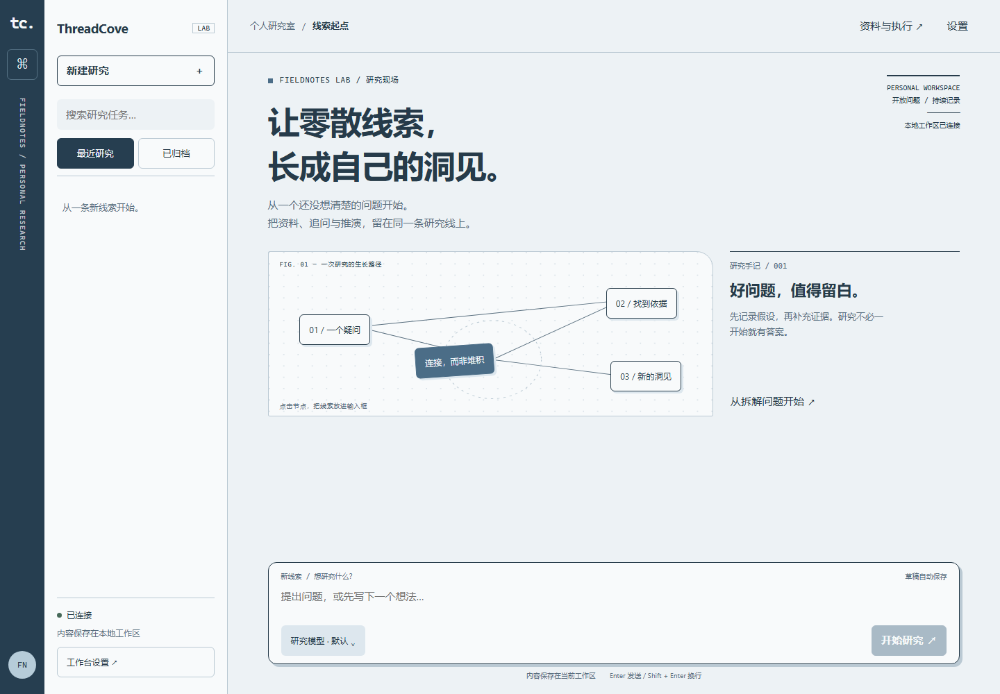
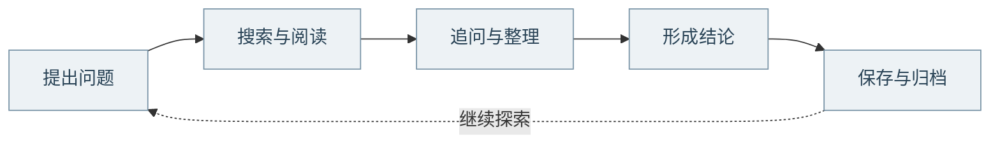
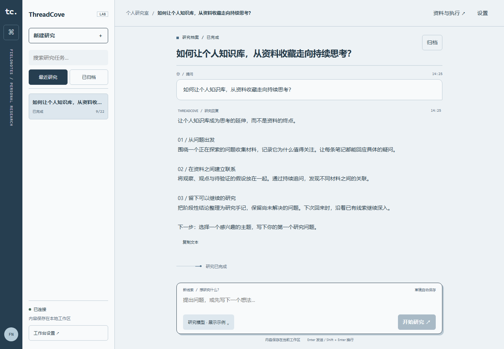
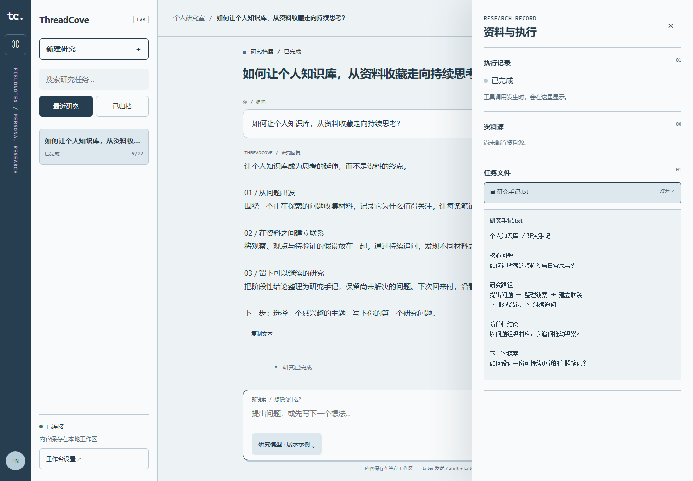

<div align="center">

# ThreadCove

### 让零散线索，长成自己的洞见。

从一个问题出发，连接资料、追问与推演，留下一份可以继续生长的研究档案。

*A personal AI research workbench. Follow the question. Keep the thread.*

[](https://github.com/Bluuok/ThreadCove/actions/workflows/validate.yml)
[](https://bun.sh)
[](packages/ui)
[](apps/electron)
[](LICENSE)

[产品界面](#产品界面) · [研究流程](#研究流程) · [快速开始](#快速开始) · [项目文档](#项目文档)



**FIELDNOTES LAB / 个人研究现场**

</div>

## 为什么做 ThreadCove

一个值得深入的问题，往往会带来许多网页、几段对话和零散的笔记。材料越来越多，思路却容易在窗口切换中断掉。

ThreadCove 把这些过程放回同一个工作台：提出问题，让 AI 协助探索资料，在对话中持续追问，再把结论和文件留在当前任务里。下次回来，仍然能找到上次思考的起点。

> 一个研究任务，一段连续的对话，一处独立的资料空间。

## 研究流程



- **开始**：记录一个疑问，或从首页的线索节点获得提问灵感。
- **深入**：由模型按需调用搜索、网页读取和子任务工具，在同一段对话里综合资料。
- **留下**：查看研究回复与任务文件，归档阶段性成果，随时重新打开并继续追问。

这是使用路径，不是固定的执行阶段或进度条；具体工具调用由模型与所选后端决定。

## 产品界面

### 从一个好问题开始

雾蓝纸面、档案索引与节点连线，组成一张可以回应你的研究手记。首页保持安静，聚焦线索时，再用轻微的描线反馈引导探索。

### 让思考有上下文，让成果有去处

| 研究对话 | 资料与成果 |
| :---: | :---: |
| [](docs/images/research-conversation.png) | [](docs/images/research-notes.png) |
| **沿着线索，让思考逐渐清晰。**<br>提问、流式回复与运行反馈，留在同一条研究线上。 | **将探索留下，成为下一次研究的起点。**<br>打开任务文件，在侧栏查看与当前研究关联的内容。 |

<sub>截图来自实际运行的界面；对话和文件为人工准备的演示内容，不代表真实在线研究结果。点击双栏图片可查看原图。</sub>

## 核心能力

| 能力 | 在工作台里做什么 |
| --- | --- |
| **连续研究对话** | 提问、追问、查看流式回复；需要时停止当前运行，保留已收到的内容。 |
| **搜索与网页阅读** | Pi 后端可按需检索资料、读取公开网页，并将来源产物保存在任务目录。 |
| **有界子任务协作** | 将独立问题交给子任务研究，由主任务汇总；宿主管理并发、次数、超时和取消。 |
| **独立研究档案** | 每个任务有独立会话与文件目录，支持历史恢复、归档和继续研究。 |
| **资料与执行侧栏** | 查看工具活动、权限请求和任务文件；大文件提供有上限的内容预览。 |
| **桌面与浏览器共用** | Electron 与 Web 共用工作台界面和事件协议，连接同一套会话服务。 |
| **模型与工具可接入** | 提供 Pi、DeepSeek、Claude 后端适配，以及 MCP/API 资料源接入层。具体能力因后端而异。 |

## 快速开始

需要 [Bun](https://bun.sh) **≥ 1.3.10**。浏览器验收脚本另需 Node.js。

### 1. 获取项目并配置模型

```bash
git clone https://github.com/Bluuok/ThreadCove.git
cd ThreadCove
bun install
```

将 `.env.example` 复制为 `.env`（PowerShell 可使用 `Copy-Item .env.example .env`），再填写自己的凭据。仓库示例使用 Pi + OpenCode Go：

```dotenv
THREADCOVE_PROVIDER=pi
THREADCOVE_PI_PROVIDER=opencode-go
THREADCOVE_MODEL=deepseek-v4.1-flash
OPENCODE_GO_API_KEY=你的密钥
```

也可使用本机加密配置，步骤见 [OpenCode Go 接入说明](docs/OPENCODE-GO.md)。模型请求使用所配置服务的额度；密钥不要提交到仓库。

### 2. 打开桌面工作台

```bash
bun run dev:electron
```

### 3. 或在浏览器中使用

分别在两个终端运行：

```bash
# 终端一：启动本地会话服务
bun run server:headless 8787
```

```bash
# 终端二：启动 Web 界面
bun run dev:webui
```

使用 headless 终端输出的带 fragment 引导链接连接。服务默认监听本机，数据默认保存在 `.threadcove-workspace/`；连接 token 保存在当前浏览器会话中。

## 项目结构

```text
ThreadCove/
├── apps/
│   ├── electron/          桌面宿主、会话服务与 RPC 处理
│   └── webui/             浏览器入口与传输适配
├── packages/
│   ├── ui/                两端共用的研究工作台
│   ├── core/              会话、消息与事件类型
│   ├── shared/            后端适配、工具、存储与通信协议
│   └── pi-agent-server/   Pi SDK 子进程与宿主工具桥接
├── scripts/               开发与验收脚本
└── docs/                  接入说明、设计文档与界面截图
```

界面通过统一 RPC 调用会话服务；模型后端产出统一事件，由宿主保存并推送到客户端。任务存储、模型适配和界面展示各自独立，便于更换后端或调整交互。

## 开发与验证

```bash
bun run typecheck
bun run lint
bun test
bun run build

# 安装浏览器后，运行 Web 界面验收
bunx playwright install chromium
bun run test:ui:web

# 本地完整验收，包含 Electron 窗口
bun run test:ui
```

CI 执行类型检查、lint、自动测试、双端构建与 Chromium 界面验收。真实模型调用需单独配置凭据；自动界面验收使用本地测试服务，不证明真实上游服务可用。

## 使用边界

- 面向个人、本地优先的研究场景，目前没有多用户权限系统、向量知识库或跨任务长期记忆。
- 搜索与子任务编排属于 Pi 研究工具链；其他后端不能视为具备相同能力。
- 网页读取面向公开 HTML、文本和 JSON；登录页面、PDF 和依赖 JavaScript 渲染的内容不在当前读取范围内。
- 中断的子任务会记录状态，不会自动恢复其 SDK 内存上下文或重新执行。来源内容与模型结论仍需核对。

## 项目文档

| 文档 | 内容 |
| --- | --- |
| [研究工具与子任务](docs/RESEARCH-TOOLS.md) | 搜索、网页读取、编排约束与来源保存 |
| [OpenCode Go 接入](docs/OPENCODE-GO.md) | API 配置、本机凭据与 Pi SDK 验证 |
| [前端设计](docs/FRONTEND-DESIGN.md) | 设计方向与共享界面实现 |
| [通信协议](docs/PROTOCOL.md) | RPC、事件与多端路由 |
| [安全模型](docs/SECURITY.md) | 凭据管理、进程边界与已知限制 |
| [实现与验收记录](docs/IMPLEMENTATION-REVIEW.md) | 实现调整与验证步骤 |
| [项目范围与复现规格](docs/REPRODUCTION_SPEC.md) | 设计范围、实现深度与边界 |

## 参与项目

欢迎通过 [Issues](https://github.com/Bluuok/ThreadCove/issues) 反馈问题或提出想法。提交改动时，请附上复现步骤与相关验证，并保持一个改动对应一个明确范围。

## License

[MIT](LICENSE)

---

<div align="center">

**不只获得一个回答，也留下通往答案的线索。**

ThreadCove · FIELDNOTES LAB

</div>
